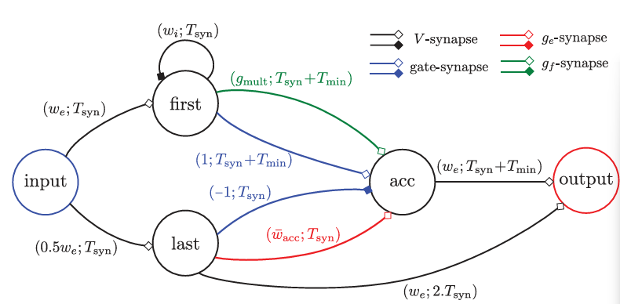
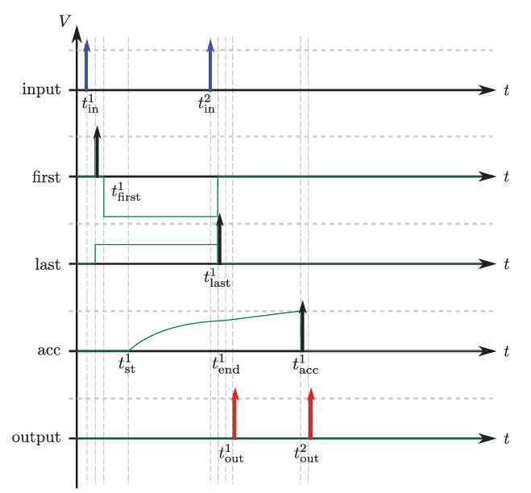

## Functional Networks in Axon SDK

The `axon_sdk.networks.functional` module implements symbolic arithmetic and nonlinear operations using biologically inspired spiking neuron circuits. These circuits follow the STICK (Spike Time Interval Computational Kernel) framework, encoding and transforming values as **spike intervals**.

---

##  Included Functional Modules

| File | Operation |
|------|-----------|
| `adder.py` | Signed 2-input addition |
| `subtractor.py` | Signed subtraction via negate + add |
| `multiplier.py` | Multiplication using log and exp |
| `signed_multiplier.py` | Signed version of `multiplier.py` |
| `scalar_multiplier.py` | Multiply by fixed constant |
| `linear_combination.py` | Weighted linear sum |
| `natural_log.py` | Natural logarithm computation |
| `exponential.py` | Exponential function |
| `divider.py` | Approximate division using exp/log |
| `integrator.py` | Continuous summation over time |
| `signflip.py` | Sign inversion (negation) |

Each of these networks is implemented as a subclass of `SpikingNetworkModule`.

## Case Study: Exponential Function (`exponential.py`)
### Purpose 
implements the exponential function \( e^x \) using a spiking network.

Where x ∈[0,1] is encoded as a spike interval, and the network emits an output spike interval corresponding to e^x also encoded as an interspike time.



### Construction

| Neuron   | Role                                   |
|----------|----------------------------------------|
| `input`  | Receives spike pair (encodes `x`)      |
| `first`  | Fires on first spike                   |
| `last`   | Fires on second spike                  |
| `acc`    | Performs gated exponential integration |
| `output` | Emits interval representing result     |

### Principle 
As described in the STICK paper (Lagorce et al. 2015) exponential encoding uses gated exponential decay to map input to output time: 
```math
tf * d/dt(gf) = -gf
```
The accumulated voltage `V(t)` rises under:
```math
tm * dV/dt = gate * gf
```

* `first` activates `gf` on `acc` with delay `Tmin`, setting exponential decay in motion.
* `gate=1` is enabled at the same time to allow `gf` to contribute to `V(t)`.
* `last` disables gate (`gate=-1`) and adds a fixed `ge` to push `acc` towards the threshold and spiking.
* `acc->output`: Once `V(t)` exceeds threshold, `output` emits a spike with interval equal to the accumulated voltage.



```python
self.connect_neurons(self.first, self.acc, "gf", gmult, Tsyn + Tmin)
self.connect_neurons(self.first, self.acc, "gate", 1, Tsyn + Tmin)
self.connect_neurons(self.last, self.acc, "gate", -1.0, Tsyn)
self.connect_neurons(self.last, self.acc, "ge", wacc_bar, Tsyn)
```

The delay of the output spike is computed as:

$$
T_{\text{out}} = T_{\text{min}} + T_{\text{cod}} \cdot e^{-x \cdot T_{\text{cod}} / \tau_f}
$$

This ensures that the spike interval output represents:

$$
y = e^x
$$

 encoded again via interspike time.


## Simulation Result Example
```
Input value: 0.5
Expected exp value: 1.6487
Decoded exp value: 1.6332
Expected exp delay: 49.3 ms
Measured exp delay: 49.7 ms
```

## Flow for Implementing New Stick Networks
1. Subclass `SpikingNetworkModule`
```python 
class MyNetwork(SpikingNetworkModule):
    def __init__(self, encoder, module_name=None):
        super().__init__(module_name)
        ...
```
2. Define neurons:
```python 
self.inp = self.add_neuron(Vt, tm, tf, neuron_name="inp")
```
3. Connect neurons with appropriate synapses:

* `V`: Jump voltage
* `ge`: Constant integration
* `gf`: Exponential
* `gate`: control input

```python
self.connect_neurons(src, tgt, "ge", weight, delay)
```

## Full Exponential Network Example
```python
from axon_sdk.primitives import (
    SpikingNetworkModule,
    DataEncoder,
)
import math

from typing import Optional


class ExponentialNetwork(SpikingNetworkModule):
    def __init__(self, encoder: DataEncoder, module_name: Optional[str] = None) -> None:
        super().__init__(module_name)
        self.encoder = encoder

        # Parameters
        Vt = 10.0
        tm = 100.0
        self.tf = 20.0
        Tsyn = 1.0
        Tmin = encoder.Tmin

        we = Vt
        wi = -Vt
        gmult = (Vt * tm) / self.tf
        wacc_bar = Vt * tm / encoder.Tcod  # To ensure V = Vt at Tcod

        # Neurons
        self.input = self.add_neuron(Vt, tm, self.tf, neuron_name="input")
        self.first = self.add_neuron(Vt, tm, self.tf, neuron_name="first")
        self.last = self.add_neuron(Vt, tm, self.tf, neuron_name="last")
        self.acc = self.add_neuron(Vt, tm, self.tf, neuron_name="acc")
        self.output = self.add_neuron(Vt, tm, self.tf, neuron_name="output")

        # Connections from input neuron
        self.connect_neurons(self.input, self.first, "V", we, Tsyn)
        self.connect_neurons(self.input, self.last, "V", 0.5 * we, Tsyn)

        # Inhibit first after spike
        self.connect_neurons(self.first, self.first, "V", wi, Tsyn)

        # Exponential computation:
        # 1. First spike → apply gf with delay = Tsyn + Tmin
        self.connect_neurons(self.first, self.acc, "gf", gmult, Tsyn + Tmin)
        self.connect_neurons(self.first, self.acc, "gate", 1, Tsyn + Tmin)
        # 2. Last spike → open gate
        self.connect_neurons(self.last, self.acc, "gate", -1.0, Tsyn)

        # 3. Last spike → add ge to trigger spike after ts
        self.connect_neurons(self.last, self.acc, "ge", wacc_bar, Tsyn)

        # Readout to output
        self.connect_neurons(self.acc, self.output, "V", we, Tsyn + Tmin)
        self.connect_neurons(self.last, self.output, "V", we, 2 * Tsyn)


def expected_exp_output_delay(x, encoder: DataEncoder, tf):
    try:
        delay = encoder.Tcod * math.exp(-x * encoder.Tcod / tf)
        Tout = encoder.Tmin + delay
        return Tout
    except:
        return float("nan")


def decode_exponential(output_interval, encoder: DataEncoder, tf):
    return ((output_interval - encoder.Tmin) / encoder.Tcod) ** (-tf / encoder.Tcod)


if __name__ == "__main__":
    from axon_sdk import Simulator

    encoder = DataEncoder(Tmin=10.0, Tcod=100.0)
    net = ExponentialNetwork(encoder)
    sim = Simulator(net, encoder, dt=0.01)

    value = 0.5
    sim.apply_input_value(value, neuron=net.input, t0=10)
    sim.simulate(150)

    output_spikes = sim.spike_log.get(net.output.uid, [])
    if len(output_spikes) == 2:
        out_interval = output_spikes[1] - output_spikes[0]
        print(f"Input value: {value}")
        print(
            f"Expected exp value: {math.exp(value)}, decoded exp value {decode_exponential(out_interval, encoder, net.tf)}, "
        )
        print(
            f"Expected exp delay: {expected_exp_output_delay(value, encoder, net.tf):.3f} ms"
        )
        print(f"Measured exp delay: {out_interval:.3f} ms")
    else:
        print(f"Expected 2 output spikes, got {len(output_spikes)}")
```

