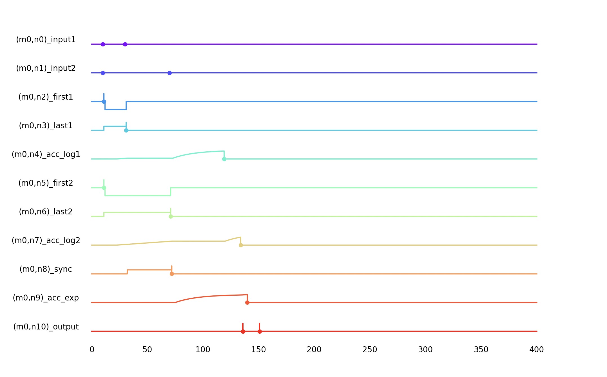
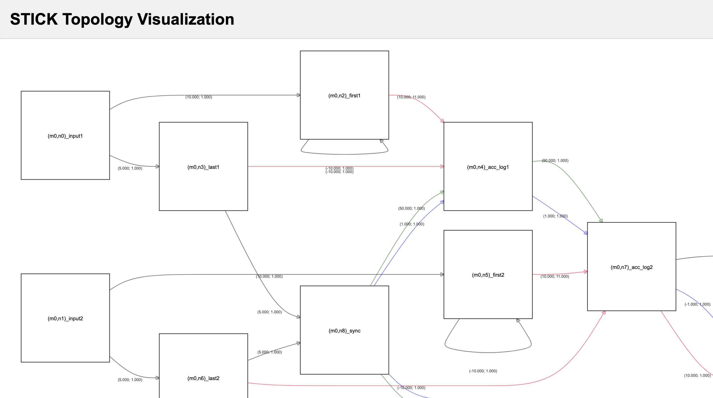

#  Visualization Tools in Axon SDK

Axon SDK provides two key visualization tools to understand spiking behavior and network topology:

1. **Chronogram Plotting** — for spike timing and voltage trace analysis
2. **Interactive Topology Viewer** — for structural exploration of STICK modules

These tools help debug and inspect both timing dynamics and network architecture.

---

##  1. Chronogram Plot (`chronogram.py`)

This tool visualizes the **membrane voltage evolution** and **spike times** across all neurons over time.

###  Key Functions

#### `plot_chronogram(timesteps, voltage_log, spike_log)`
- Draws voltage traces for each neuron
- Displays spike events as scatter points
- Labels neurons with their `uid` (and optional metadata)

Each subplot shows:
- `V(t)` trace of a neuron
- Red dots for emitted spikes
- Gray gridlines and minimal axis clutter

An example plot might look like this:


#### `build_array(length, entry_points, fill_method='ffill')`
Used to convert sparse voltage logs into dense time-series arrays using forward-fill or zero-fill.

### Example Use

```python
sim.plot_chronogram()
```

Here is the resulting chronogram plot:
