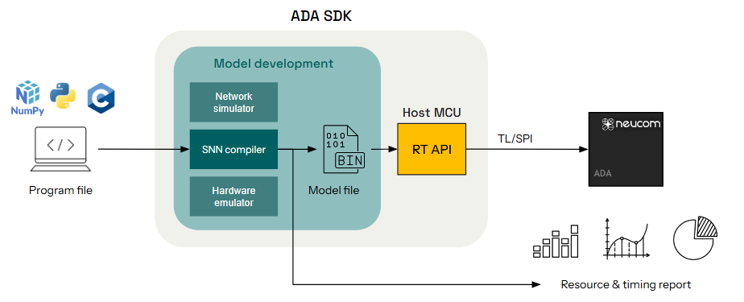

# Axon: The STICK Software Development Kit

The brain, a truly efficient computation machine, encodes and processes information using discrete spikes. Inspired by this, we've built **Axon**, a neuromorphic software framework for building, simulating, and compiling **spiking neural networks (SNNs)** for general-purpose computation. Axon allows to build complex computation by combining modular computation kernels, avoiding the challenge of having to train case-specific SNN while maintaining the sparsity of spike computing.

Axon is an extension of **[STICK (Spike Time Interval Computational Kernel)](https://arxiv.org/abs/1507.06222)**.



Axon provides an end-to-end pipeline for deploying interval-coded SNNs to ultra-low-power neuromorphic hardware. At Neucom we're building one of such chips and we're calling it **ADA**. ADA It is built for embedded deployment, yet flexible enough for rapid prototyping and quick iteration cycle.

The Axon SDK includes:

- A **Python-based simulator** for cycle-accurate emulation of interval-coded symbolic computation.
- A **hardware-aware compiler** that translates Python-defined algorithms into spiking circuits, ready for simulation or deployment.
- Tools for **resource reporting**, cycle estimation, and performance profiling of the deployed algorithms.

If you're building symbolic SNNs for embedded inference, control, or cryptographic tasks, Axon makes it easy to translate deterministic computations into spiking neural networks.

---

## Axon SDK structure

| Component           | Description                                                                 |
|---------------------|-----------------------------------------------------------------------------|
| `axon_sdk.primitives`    | Base clases defining the low level components and engine used by the spiking networks|
| `axon_sdk.networks`    | Library of modular spiking computation kernels |
| `axon_sdk.simulator`    | Spiking network simulator to input spikes, simulate dynamics and read outputs |
| `axon_sdk.compilation`     | Compiler for transforming high-level algorithms into spiking networks   |

---

## Example: Multiplication spiking-network
```python
from axon_sdk.simulator import Simulator
from axon_sdk.networks import MultiplierNetwork

encoder = DataEncoder(Tmin=10.0, Tcod=100.0)
net = MultiplierNetwork(encoder)

val1 = 0.1
val2 = 0.5

sim = Simulator(net, encoder, dt=0.01)

# Apply both input values
sim.apply_input_value(val1, neuron=net.input1, t0=10)
sim.apply_input_value(val2, neuron=net.input2, t0=10)

# Simulate long enough to see output
sim.simulate(simulation_time=400)

spikes = sim.spike_log.get(net.output.uid, [])
interval = spikes[1] - spikes[0]
decoded_val = encoder.decode_interval(interval)
```
```text
decoded_val
>> 0.05
```

## Citation
If you use **Axon** in your research, please cite:
```
@misc{axon2025,
  title        = {Axon: A Software Development Kit for Symbolic Spiking Networks},
  author       = {Neucom},
  howpublished = {\url{https://github.com/neucom/axon}},
  year         = {2025}
}
```

## License
**Axon SDK** is open-sourced under a **GPLv3 license**, preventing its inclusion in closed-source projects.

Reach out to initiate a collaboration if you need to use **Axon SDK** in your closed-source project.


<p align="right">
  
</p>